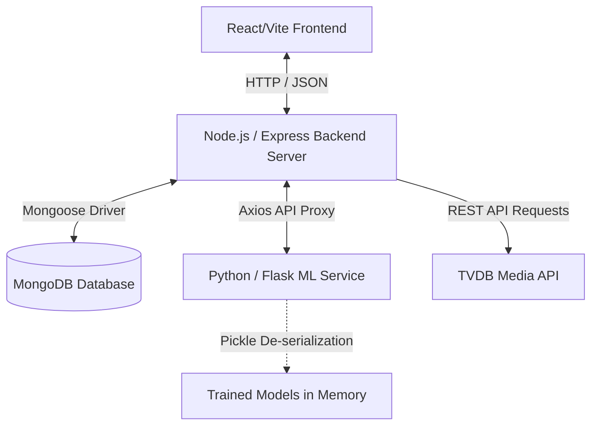

# CineMatch 🎬 — AI-Powered Movie Recommendation Platform

CineMatch is a full-stack, enterprise-grade movie recommendation platform. By utilizing Natural Language Processing (NLP) and content-based filtering algorithms, it analyzes metadata attributes (including genres, key plot overviews, main cast members, directors, and search keywords) to deliver highly personalized suggestions to users.

The system features a slick, dark-themed responsive frontend, a secure Node.js authentication and profile backend, and a specialized Flask-based machine learning service.

---

## 🌟 Key Features

### 🧠 Content-Based Recommender Engine
- Parses complex movie metadata into unified semantic "tags".
- Measures similarities between 4,800+ movies instantly using Vectorization and Cosine Similarity matrices.
- Returns the top 5 closest recommendations based on multiple overlapping data points.

### 🖼️ Dynamic Media Loading
- Integrates with the official **TVDB API** to dynamically fetch movie posters.
- Automatically handles token authentication, token caching, and fallback states.
- Displays poster images inside search recommendations, trending movies, and user favorites.

### 🔐 User Management & Profiles
- Sign up and log in securely with password encryption via **bcrypt** hashing.
- JSON Web Token (JWT) stateless auth stored on the client side with automatic token expiry handling.
- Personal profiles tracking date of signup, stats (total favorites, total searches), and private lists.

### 📁 Custom Bookmarks & Analytics
- **Favorites**: Add/remove movies from a collection with one click.
- **Search History**: Tracks and logs all queries with timestamp indicators.
- **Slick Autocomplete**: Real-time debounce dropdown list presenting title matches as you type.

---

## 📐 Architecture & Technology Stack

CineMatch is structured around a three-tier decoupled architecture:



### 1. Frontend (React / Vite)
- **Vite**: Rapid hot-reloading toolchain.
- **State Management**: React hooks (Context API, `useState`, `useEffect`) managing user state globally.
- **Styling**: Vanilla CSS custom variables, Tailwind CSS utilities, and custom glassmorphism styles.
- **Network Layer**: Axios instance pre-configured with interceptors to inject JWT headers and handle 401 logouts gracefully.

### 2. Backend (Node.js / Express)
- **Mongoose**: Models relations for MongoDB (Users, Search History, Favorites).
- **JWT**: Controls session authentication.
- **TVDB Poster Integration**: Dynamically requests JWT tokens from TVDB login service, maintains a token expiration cache, and calls media search services to assign images to data payloads.

### 3. Machine Learning Service (Python / Flask)
- **Flask**: Microframework exposing similarity calculations via REST endpoints.
- **Pandas/NumPy**: Ingests, processes, and manages movie matrices.
- **Scikit-Learn**: Drives the Count Vectorizer and Cosine Similarity computations.

---

## 🧠 Recommendation Engine Mechanics

To understand how recommendations are computed, the ML model undergoes a multi-step data engineering process:

### 1. Data Cleaning & Feature Extraction
The raw TMDB dataset stores complex attributes (genres, keywords, cast, and crew) as stringified JSON arrays. We parse these arrays using Python's `ast.literal_eval`:
- **Genres & Keywords**: Extracted into a flat list of strings.
- **Cast**: Keeps only the top 3 actors (e.g., `["Christian Bale", "Michael Caine", "Liam Neeson"]`).
- **Crew**: Searches for `job == "Director"` and keeps the director's name (e.g., `["Christopher Nolan"]`).

### 2. Removing Spaces
To ensure the vectorizer views names and genres as unique entities rather than individual words, we strip out all spaces:
- `"Johnny Depp"` ➡️ `"JohnnyDepp"`
- `"Science Fiction"` ➡️ `"ScienceFiction"`

### 3. Creating Semantic Tags
The parsed arrays are combined with the word-tokenized `overview` (plot summary) to form a unified block of text:
```python
movies['tags'] = movies['overview'] + movies['genres'] + movies['keywords'] + movies['cast'] + movies['crew']
# Formatted as a single lowercase string:
# "in a future world where... sciencefiction post-apocalyptic artificialintelligence christophernolan..."
```

### 4. Vectorization and Cosine Similarity
We instantiate a `CountVectorizer` to convert text tags into sparse binary numerical vectors. Stop words (e.g., "the", "and") are removed, and we limit vocabulary size to the top 5,000 most frequent tokens:
$$\text{Vector } A = [x_1, x_2, \dots, x_{5000}]$$

To measure the similarity score between any two movie vectors ($A$ and $B$), we calculate the Cosine Similarity (the cosine of the angle between them in the 5000-dimensional vector space):

$$\text{Similarity}(A, B) = \cos(\theta) = \frac{A \cdot B}{\|A\| \|B\|} = \frac{\sum_{i=1}^{n} A_i B_i}{\sqrt{\sum_{i=1}^{n} A_i^2} \sqrt{\sum_{i=1}^{n} B_i^2}}$$

This output scale ranges between `0.0` (completely dissimilar) and `1.0` (highly similar).

---

## 🛠️ Codebase Component Breakdown

Here is a file-by-file breakdown of the core modules that implement the platform logic:

### 1. Flask Machine Learning Service (`ml-service/`)
- `train_model.py`: Ingests raw CSV data files, merges the credits dataset with movie details, extracts tags using JSON helpers, maps spaces, fits `CountVectorizer` and computes the N×N Cosine Similarity matrix, exporting the output datasets to `.pkl` files.
- `app.py`: A lightweight Flask server. Instantiates CORS, loads the `.pkl` files on startup into standard RAM memory, builds a case-insensitive movie search index, and exposes `/recommend`, `/movies`, and `/trending` HTTP endpoints.

### 2. Node.js backend (`backend/`)
- `server.js`: Connects to MongoDB, sets up JSON parsing, binds cross-origin resource sharing, and links auth and recommendation routers.
- `middleware/auth.js`: Extract JWT Bearer tokens from incoming HTTP request headers, verifies them against `JWT_SECRET`, and maps user sessions directly into request objects.
- `routes/auth.js`: Implements `/signup`, `/login`, and `/me` routes utilizing bcrypt hashes and generating JWT tokens.
- `routes/recommend.js`: Connects backend services to the ML service API, manages token handshakes and caching for the TVDB Poster API, cleans movie titles of trailing year indicators, maps visual assets, and writes logs to user history databases.

### 3. React Frontend (`frontend/`)
- `src/context/AuthContext.jsx`: Provides global React state tracking authentication status, user profile details, and handles initialization of cookies and API clients.
- `src/lib/api.js`: Instantiates Axios with client defaults and interceptors to inject JWT headers automatically and catch unauthorized redirects.
- `src/components/SearchBox.jsx`: Sets up autocomplete input boxes with debounced suggestion lists that query search endpoints.
- `src/components/MovieCard.jsx`: Standard card rendering movie details (ratings, genres) and posters.
- `src/pages/Home.jsx`: The homepage rendering movie recommendations and trending movie lists.
- `src/pages/Profile.jsx`: Profile summary tabs showing stats, recent searches, and saved favorites.

---

## 🗄️ Database Schemas (MongoDB)

CineMatch uses MongoDB to manage dynamic data. The following outlines our Mongoose models:

### User Model (`backend/models/User.js`)
```javascript
const UserSchema = new mongoose.Schema({
  name: { type: String, required: true },
  email: { type: String, required: true, unique: true },
  password: { type: String, required: true },
  createdAt: { type: Date, default: Date.now },
  favorites: [
    {
      movieId: Number,
      title: String,
      genres: [String],
      addedAt: { type: Date, default: Date.now }
    }
  ]
});
```

### History Model (`backend/models/History.js`)
```javascript
const HistorySchema = new mongoose.Schema({
  userId: { type: mongoose.Schema.Types.ObjectId, ref: 'User', required: true },
  search: { type: String, required: true },
  searchedAt: { type: Date, default: Date.now },
  results: [
    {
      movieId: Number,
      title: String,
      genres: [String],
      similarity_score: Number
    }
  ]
});
```

---

## 📡 API Specification

### Authentication Services

#### Sign Up User
- **Endpoint**: `POST /api/auth/signup`
- **Request Body**:
  ```json
  {
    "name": "Alex Mercer",
    "email": "alex@example.com",
    "password": "securepassword123"
  }
  ```
- **Response**:
  ```json
  {
    "token": "eyJhbGciOiJIUzI1NiIsInR5cCI6IkpXVCJ9...",
    "user": {
      "id": "603d2e5a4f1a2c3d4e5f6a7b",
      "name": "Alex Mercer",
      "email": "alex@example.com"
    }
  }
  ```

#### Log In User
- **Endpoint**: `POST /api/auth/login`
- **Request Body**:
  ```json
  {
    "email": "alex@example.com",
    "password": "securepassword123"
  }
  ```
- **Response**:
  ```json
  {
    "token": "eyJhbGciOiJIUzI1NiIsInR5cCI6IkpXVCJ9...",
    "user": {
      "id": "603d2e5a4f1a2c3d4e5f6a7b",
      "name": "Alex Mercer",
      "email": "alex@example.com"
    }
  }
  ```

---

### Movie & Recommendation Services

#### Get Recommendations
- **Endpoint**: `POST /api/recommend`
- **Headers**: `Authorization: Bearer <JWT_TOKEN>` (Optional, saves search to history if provided)
- **Request Body**:
  ```json
  {
    "movie": "Batman Begins",
    "top_n": 5
  }
  ```
- **Response**:
  ```json
  {
    "searched": {
      "movieId": 272,
      "title": "Batman Begins",
      "genres": ["Action", "Crime", "Drama"],
      "image_url": "https://api4.thetvdb.com/banners/posters/272.jpg"
    },
    "recommendations": [
      {
        "movieId": 155,
        "title": "The Dark Knight",
        "genres": ["Action", "Crime", "Drama"],
        "similarity_score": 39.8,
        "image_url": "https://api4.thetvdb.com/banners/posters/155.jpg"
      },
      {
        "movieId": 49026,
        "title": "The Dark Knight Rises",
        "genres": ["Action", "Crime", "Drama"],
        "similarity_score": 36.1,
        "image_url": "https://api4.thetvdb.com/banners/posters/49026.jpg"
      }
    ]
  }
  ```

#### Get Autocomplete Movie Titles
- **Endpoint**: `GET /api/movies?q=<query>`
- **Response (e.g., `GET /api/movies?q=toy`)**:
  ```json
  [
    {
      "movieId": 862,
      "title": "Toy Story",
      "genres": ["Animation", "Comedy", "Family"]
    },
    {
      "movieId": 863,
      "title": "Toy Story 2",
      "genres": ["Animation", "Comedy", "Family"]
    }
  ]
  ```

---

### Favorites & History Services

#### Get User Favorites
- **Endpoint**: `GET /api/favorites`
- **Headers**: `Authorization: Bearer <JWT_TOKEN>`
- **Response**:
  ```json
  [
    {
      "movieId": 272,
      "title": "Batman Begins",
      "genres": ["Action", "Crime", "Drama"],
      "image_url": "https://api4.thetvdb.com/banners/posters/272.jpg"
    }
  ]
  ```

#### Add User Favorite
- **Endpoint**: `POST /api/favorites`
- **Headers**: `Authorization: Bearer <JWT_TOKEN>`
- **Request Body**:
  ```json
  {
    "movieId": 272,
    "title": "Batman Begins",
    "genres": ["Action", "Crime", "Drama"]
  }
  ```

---

## 🛠️ Configuration & Environment Variables

Create a `.env` file inside the `backend/` directory to configure the application runtime options:

| Variable | Description | Example / Default |
| :--- | :--- | :--- |
| `PORT` | Listening port for the Node.js Express server. | `3001` |
| `MONGODB_URI` | Connection URI for the MongoDB server or database cluster. | `mongodb://localhost:27017/cinematch` |
| `JWT_SECRET` | Secret key used to sign and verify user session tokens. | `some_long_random_hash` |
| `FLASK_ML_URL` | Base URL pointing to the Python Flask ML microservice. | `http://localhost:5000` |
| `TVDB_API_KEY` | Developer API key from TheTVDB API v4. | `your_tvdb_api_key` |

---

## 🔍 Troubleshooting & FAQ

#### Q: The React frontend displays a blank screen or a loading loop.
- **Check**: Ensure both the Node.js Backend (port 3001) and Flask ML Service (port 5000) are running. Open your browser console (F12) to verify if the frontend is receiving 504 errors on API requests.

#### Q: The recommendations load, but all posters show a blank color block.
- **Check**: The server might not be authenticated with the TVDB API. Ensure your `backend/.env` file contains a valid `TVDB_API_KEY`. Without a valid API key, the poster service will fall back to displaying the first letter of the movie title.

#### Q: The Node.js terminal displays `EADDRINUSE: address already in use :::3001`
- **Check**: Another node instance is running on port 3001. Find and terminate it:
  - **Windows (PowerShell)**:
    ```powershell
    Get-Process -Id (Get-NetTCPConnection -LocalPort 3001).OwningProcess | Stop-Process -Force
    ```
  - **Mac/Linux**:
    ```bash
    kill -9 $(lsof -t -i:3001)
    ```

#### Q: I want to customize the recommendation rules or retraining attributes.
- **Action**: Modify `ml-service/train_model.py`. You can adjust the `max_features` attribute in `CountVectorizer` or incorporate more features (such as release year or country) inside the `tags` builder. Re-run `python train_model.py` to regenerate the pickles.

---

## 📄 License & Attributions
- Movie datasets provided by GroupLens (Kaggle TMDB 5000 Movie Dataset).
- Posters provided by TheTVDB.
- Built as an open-source educational portfolio project.
